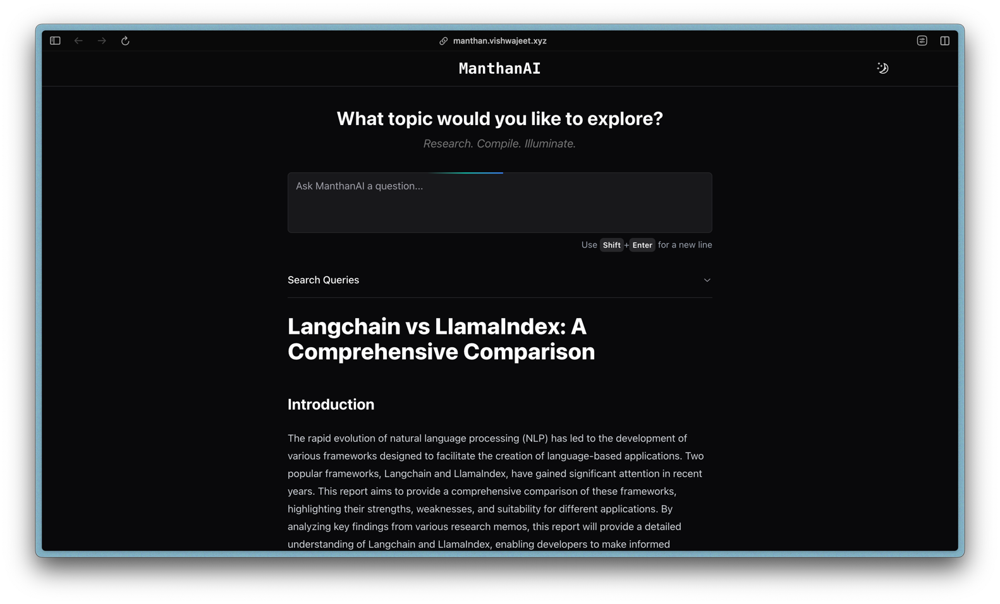
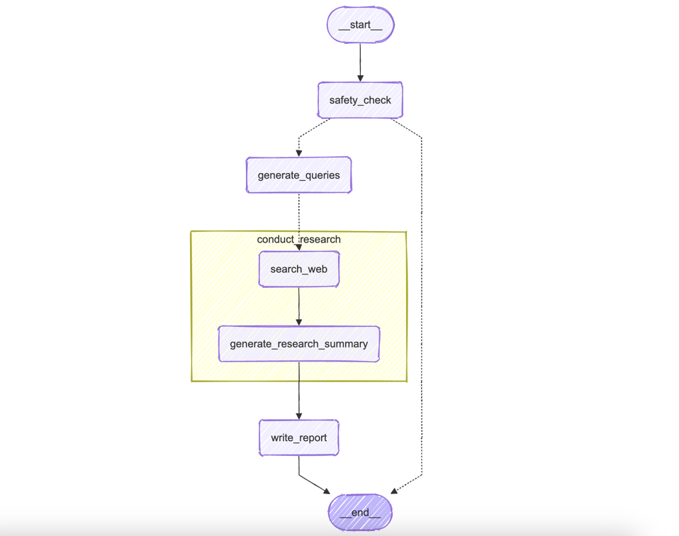

# ManthanAI - Research Assistant

**ManthanAI** is a lightweight research assistant designed to simplify web research using state-of-the-art AI models like **LLaMA** (structured output) and **Google Gemini** (research report generation). Built on the **LangGraph** framework, it provides real-time streaming updates, allowing you to watch your research unfold live.

Inspired by [GPT Researcher](https://github.com/assafelovic/gpt-researcher), **ManthanAI** focuses on generating search queries, gathering and summarizing web data, and providing real-time, streaming updates as the research progresses.

## Getting Started 🚀  
### [Give it a go](https://manthan.vishwajeet.xyz) 💡  


### Graph 🦜  
Here’s a look at the research flow:



- **Safety Check**: Ensures input topic safety before proceeding.
- **Generate Queries**: Generates search queries based on the topic.
- **Conduct Research**: For each query,:
  - **Search Web**: Gathers relevant data from the web.
  - **Generate Research Summary**: Compiles findings into a concise summaries.
- **Write Report**: Final research report is prepared.

### Key Highlights ✨  
- **Backend**: FastAPI backend manages research workflows and streaming.  
- **Frontend**: Next.js and shadcn/ui offers a clean and interactive experience.  
- **AI-Powered Research**: Uses **LangGraph** with LLaMA 70B and Google Gemini for web research.  
- **Safety First**: Implemented content safety checks to ensure safe research topics.
- **Real-Time Progress**: Follow research updates and outcomes as they happen through the streaming API.
- **Asynchronous Design**: Handles multiple research tasks concurrently using asyncio for better performance.
- **User Feedback**: Allows users to upvote or downvote research results, stored with LangSmith.

## Setup ⚙️

1. **Clone the Repository**:  
```bash
git clone https://github.com/git-vish/manthan.git
cd manthan
```

### Backend 🧩  
2. **Set Up Virtual Environment & Install Dependencies**:
   - **pip**:
     ```bash
     cd backend
     python -m venv .venv
     source .venv/bin/activate
     pip install -r requirements.txt 
     ```
   - **uv**:
     ```bash
     pip install uv
     cd backend
     uv sync --frozen
     source .venv/bin/activate
     ```

3. **Set Up Environment Variables**:  
Copy `.env.example` to `.env` and fill in the required fields.  
```bash
cp .env.example .env
```

4. **Run the Backend**:
```bash
uvicorn src.api:app --reload
```

### Frontend 🖥️  
5. **Install Frontend Dependencies**:
```bash
cd ../frontend
npm install
```

6. **Set Up Environment Variables**:  
Copy `.env.local.example` to `.env.local` and configure API details:
```bash  
cp .env.local.example .env.local  
```

7. **Run the Frontend**:
```bash
npm run dev
```

## License 📜  
This project is licensed under the MIT License. Check the [LICENSE](LICENSE) file for more details.

## Feedback & Contributions 🙌  
Your feedback and contributions are welcome! Please feel free to open an issue or submit a pull request.